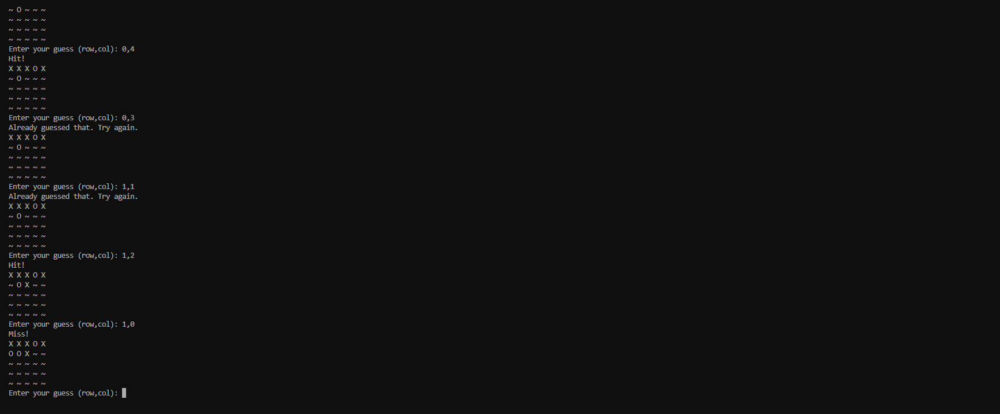

<h1 align="center">Battleship Game(My 3rd project)</h1>

This a classic Battleship game running on a terminal in a code editor. Simple and fun!

<h2 align="center"></h2>

## User Experience (UX)

- ### User Stories

    - #### First-time visitor goals

        - Understand how to play the game immediately.
        - Start the game quickly.

    - #### Frequent user goals
        - Challenge oneself with different difficulty levels by changing grind size.

- ### Design

  - The game uses simple symbols and letters from the keyboard to represent ships, hits, and misses, ensuring a clear and enjoyable user experience.

* ### Wireframes

    - Used Draw.io to make a Flowchart for the game [View](images/flowchart.png)

## Features

- Easy to start
- Dynamic ship placement for each game

## Technologies Used

### Languages Used

- [Python](https://www.python.org/)

### Programs Used

1. [Git](https://git-scm.com/)
    - Git was used for version control by utilizing the Gitpod terminal to commit to Git and push to GitHub.
1. [GitHub:](https://github.com/)
    - GitHub is used to store the project's code after being pushed from Git.

## Testing

The game was tested on visual studio

### Testing User Stories from User Experience (UX) Section

- #### First-time visitor goals

    - Understand how to play the game immediately.
    - Start a new game quickly.
        - Just run the code and the game will start in the treminal.

- #### Returning visitor goals
  
    - The game can be paused and resumed, and new games can be started easily.
    - See previous scores or game history.

- #### Frequent user goals

    - Challenge oneself with different difficulty levels.
        - Different difficulty levels are available by changing the size of the grind.

### Further Testing

- The game was tested many times to make sure that the game is clean without bugs.
- Friends were asked to play the game and provide feedback.

## Deployment

### GitHub Pages

The project was deployed to GitHub Pages using the following steps...

1. Log in to GitHub and locate the [GitHub Repository](https://github.com/Tiko4real/3rd_project).
2. At the top of the Repository (not the top of the page), locate the "Settings" Button on the menu.
3. Scroll down the Settings page until you locate the "GitHub Pages" Section.
4. Under "Source", click the dropdown called "None" and select "Master Branch".
5. The page will automatically refresh.

### Forking the GitHub Repository

By forking the GitHub Repository, we make a copy of the original repository on our GitHub account to view and/or make changes without affecting the original repository by using the following steps...

1. Log in to GitHub and locate the [GitHub Repository](https://github.com/Tiko4real/3rd_project).
2. At the top of the Repository (not the top of the page) just above the "Settings" Button on the menu, locate the "Fork" Button.
3. You should now have a copy of the original repository in your GitHub account.

### Making a Local Clone

1. Log in to GitHub and locate the [GitHub Repository](https://github.com/Tiko4real/3rd_project).
2. Under the repository name, click "Clone or download".
3. To clone the repository using HTTPS, under "Clone with HTTPS", copy the link.
4. Open Git Bash.
5. Change the current working directory to the location where you want the cloned directory to be made.
6. Type `git clone`, and then paste the URL you copied in Step 3.

